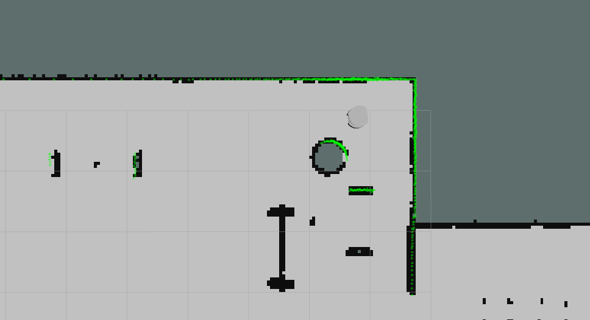
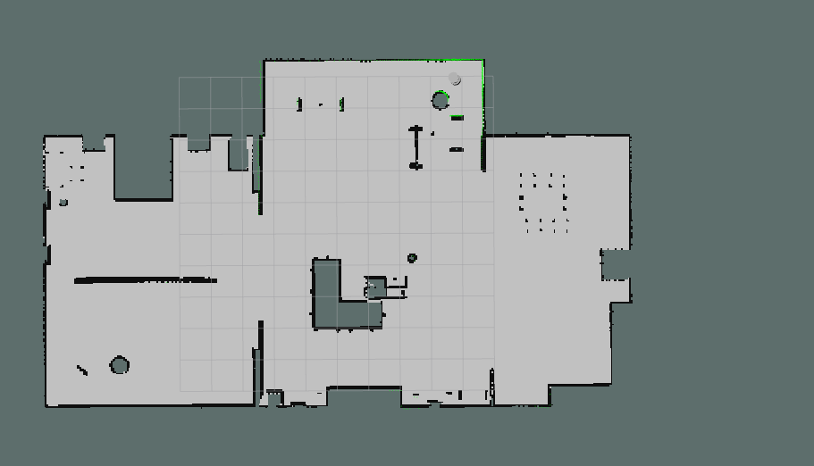
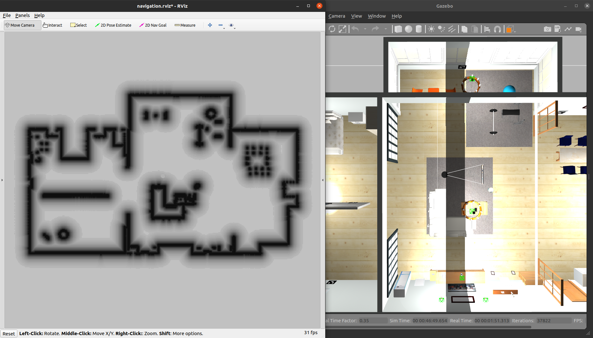
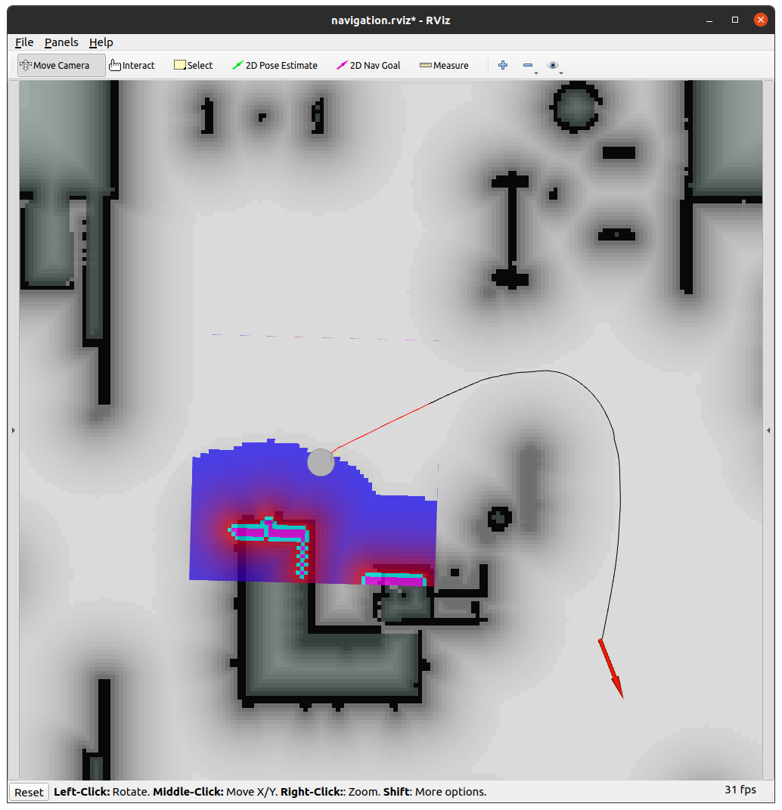
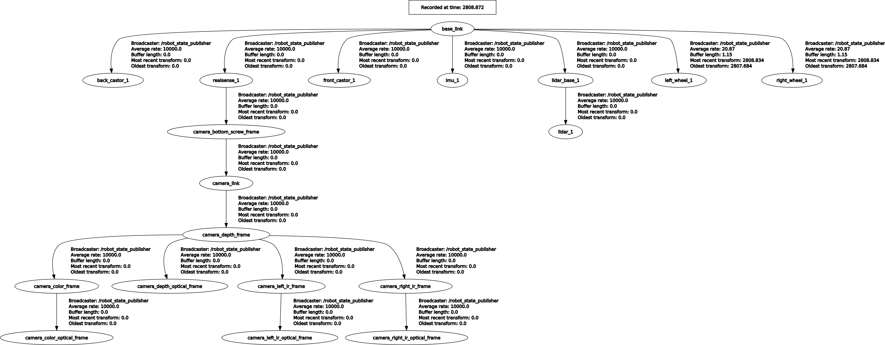
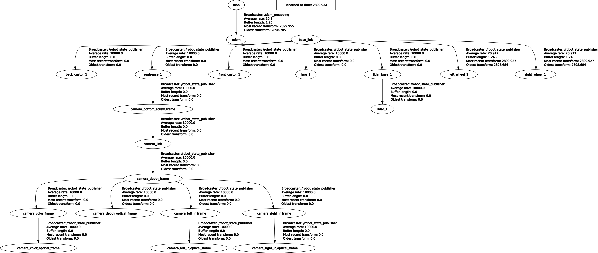

## Ideology

Spawning of the robot happens as simply as launching the two launch files provided. `spawn_model` within `gazebo_ros` pacakge, the node responsible to launch the robot has been included within the `tortoisebotpromax_playground` itself. With the robot spawned the lidar data published on the topic `scan` by gazebo can be visualized using rviz.

<p align="center">
	
</p>
<p align="center">
	<b>Visualization of /scan topic</b>
</p>

To generate the map, `gmapping` package was utilized  which only has two requirements, `/scan` topic and transform between `/odom` and `base_link` frame.

Apart from gmapping, slam toolbox and cartographer package were also taken into consideration for mapping, but gmapping was chosen for its simplicity.

<p align="center">
	
</p>
<p align="center">
	<b>Generated map by gmapping package</b>
</p>

[Video Reference](https://github.com/maker-ATOM/robonautica_mapping/tree/master/media)

> Document of detection of aruco markers

With Aruco markers detected and the pose of the robot stored in the form of waypoints the robot is now capable of autonomously capable of navigating in the environment.

<p align="center">
	
</p>
<p align="center">
	<b>Global Planner</b>
</p>

<p align="center">
	
</p>
<p align="center">
	<b>Local planner</b>
</p>

> Still there are two human intervention points, i) Generation of waypoints and providing it to the Robot and ii) Generation of map, the current navigation stack uses preloaded map to traverse the env.

For controller `next_goal_pose` is published on topic `move_base_simple/goal` and subscribes to `odom` topic to check if the robot has reached the position or not.

**This can be replace with `Actiionib` APIs**

## Task Completed

- [x] Spawn at the origin of the environment 
- [x] Teleoperate the robot and map the environment.
- [x] localization for SLAM.
- [x] Statc Path plan using move_base 
- [x] Collision avoidance and control of the robot using move_base from Navigation stack.
- [ ] Scan the ArUco markers and store the robot’s closest possible pose
with respect to the marker when scanning the ArUco marker.
- [ ] Autonomously navigate to each ArUco marker
- [x] Controller node so robot reaches all the generated waypoints
	- [x] Convert quats to yaw 
	- [x] Increase bot speed
	- [ ] Change controller architecture from PubSub to actionlib
	- [ ] Log statements
	- [ ] Wait for 15 seconds


## What next?

As the robot is teleoperated, a individual script will be running which detects the ArUco markers using `openCV`. After detection Ids will be assigned to each marker. The robot will keep on moving until the size of the maker sensed by the camera does reaches the mentioned threshold and the shape of the maker does not aligns to be square, inferring that the robot has aligned with the makers. At this position the pose of the robot will be stored in the form of waypoints.

One thing that actually concerns me is that does not this defies the concept of autonomous navigation. Since the waypoints are detected by the robot operated in teleoperation mode and the robot is made to traversal those waypoint, there is a human intervention involved.

What I feel should actually happen is that, there should a navigation stack such as the `ROS Navigation Stack` which should be responsible to map the environment, localize the robot and navigate the environment while avoiding any obstacle within the path. The robot will receive goal positions to reached indicated using AcUro markers. Initially with no makers the robot will traverse the environment trying to visit the unvisited area of the environment until any AuRco makers is detected.

## Errors during Execution

First error encountered was the,

```python
[ERROR] [1696795821.366083727]: material 'silver' is not unique.
```

After launching `tortoisebotpromax_playground.launch` before the issue was [resolved](https://github.com/rigbetellabs/Robonautica/issues/1) an attempt was made to solved the issue by changing the `material.xacro` file within the `tortoisebotpromax_description` package.

From,

```python
<material name="silver">
  <color rgba="0.700 0.700 0.700 1.000"/>
</material>
```

To,

```python
<material name="grey">
  <color rgba="0.700 0.700 0.700 1.000"/>
</material>
```

After resolving this robot was spawned successfully within the gazebo and the `robot_description` was able to visualize in rviz.

---

Secondly, while generating the map of the environment, it was noticed that out of two things required for the `gmapping` to generate the map, which are `scan` topic where the lidar data is published and transform between `odom` and `base_link` frame which is used to identify the position of the robot from initial point. The transform was missing.


<p align="center">
	
</p>
<p align="center">
	<b>Missing /odom frame in the tf_tree</b>
</p>

Before the error was [resolved](https://github.com/rigbetellabs/Robonautica/issues/3), a idea was presented to create a node which will subscribe to the topic `/odom` (which did exist) and then publish the transform so that the requirements of gmapping can be satisfied.

It was also found that if any frame is found missing by the gmapping package it initiates to publish to the frame itself.

<p align="center">
	
</p>
<p align="center">
	<b>No link between odom and base_link frame as gmapping publishes the frame which it should.</b>
</p>

Before a node can created the issue was resolved.

---

While perofrming navigation, the local map was not able to detect and avoid obstacles, this was because the lidar frame was wrongly provide to it.

## Usage

Clone the repository into your src directory of ros workspace

```python
cd ~/catkin_ws/src

git clone git@github.com:maker-ATOM/robonautica_mapping.git
```

Build the workspace

```pyton
cd ~/catkin_ws
catkin_make
```

### Step 1 : Mapping

Launch gazebo using,

```python
roslaunch tortoisebotpromax_gazebo tortoisebotpromax_playground.launch
```

Launch rviz to visualize the map,

```python
roslaunch tortoisebotpromax_description display.launch
```

⚠️ **Note:**
<br>
> Execute Aruco marker detection and waypoint storage script in this gmapping launch file.

```
pip3 install opencv-contrib-python==4.4.0.46
```

Launch gmapping to generate the map of the environment,

```python
roslaunch robonautica_mapping gmapping.launch
```

Teloperate the robot using,

```python
rosrun teleop_twist_keyboard teleop_twist_keyboard.py
```

As the robot is being controller using teleop node, generated map can be visualized in rviz.

To save the generated map,
```python
rosrun map_server map_saver -f map
```
copy this folder to `robonautica_slam` package

### Step 2.1 : AMCL

Launch gazebo using,

```python
roslaunch tortoisebotpromax_gazebo tortoisebotpromax_playground.launch
```

Lauch AMCL node for to visualise localization,
```python
roslaunch robonautica_slam amcl.launch
```

Teleop the robot to see the robot in action.

```python
rosrun teleop_twist_keyboard teleop_twist_keyboard.py
```

### Step 2.2 : SLAM

```python
roslaunch tortoisebotpromax_gazebo tortoisebotpromax_playground.launch
```

Lauch AMCL node for to visualise localization,
```python
roslaunch robonautica_slam amcl.launch
```

Make sure the robot place in the physical env and robot in simulation are at the same position. If not use inital_pose using Rviz

Lanch `move_base` node to perform navigation.

```python
roslaunch robonautica_slam move_base.launch
```

_Update:_ `amcl.launch` and `move_base.launch` have been added into`navigation.launch` so both launch files can be launnched using a single launch file file.

### Step 3 : Controller Node for Autonomous Navigation

```python
roslaunch tortoisebotpromax_gazebo tortoisebotpromax_playground.launch
```

```python
roslaunch robonautica_slam navigation.launch
```

```python
rosrun robonautica_waypoints controller.py
```

## Step 4 : Lane and Obstacle

Gazebo

```python
roslaunch tortoisebotpromax_gazebo tortoisebotpromax_traffic_iisc.launch
```

Rviz

```python
rviz -d ~/catkin_ws/src/Robonautica-AMR/robonautica_lane/rviz/lane.rviz 
```


**Note:** All the above ros command should be executed in different terminal.
